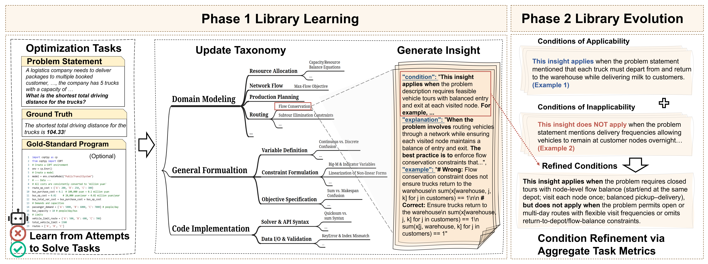

<h1>
  
  AlphaOPT: Formulating Optimization Programs with Self-Improving LLM Experience Library
</h1>

<p align="center">
  <a href="https://opensource.org/licenses/MIT">
    
  </a>
  <a href="https://www.python.org/downloads/">
    
  </a>
</p>

<p align="center"> <br></p>

We present AlphaOPT, a self-improving experience library that enables an LLM to learn from limited demonstrations (i.e, even answers along without gold-standard program) and solver feedback without annotated reasoning traces or parameter updates. AlphaOPT operates a continual two-phase cycle: (i) a Library Learning phase that reflects on failed attempts, extracts solver-verified, structured insights as $\{\textit{taxonomy},\ \textit{condition},\ \textit{explanation},\ \textit{example}\}$; and (ii) a Library Evolution phase that diagnoses retrieval misalignments and refines the applicability conditions of stored insights, improving transfer across tasks. 

## 🚀 Quick Start

### 1. Repository Structure

```
Self-Improve-LLM-OPT/
├── src/                         # Core source code
│   ├── llm_programmer.py        # LLM programmer
│   ├── llm_retriever.py         # LLM retriever
│   ├── llm_evolver.py           # LLM evolver
│   ├── llm_extractor.py         # LLM extractor
│   ├── llm_diagnostic.py        # LLM diagnostic
│   ├── experience_library.py    # Experience library management
│   ├── dataloader.py            # Data loader
│   ├── utils.py                 # Utility functions
│   └── prompts/                 # Prompt templates
├── data/                        # Data directory
│   ├── optimization_tasks/      
│   └── experience_library/      
├── main.py                     # Main training script
├── evaluation.py               # Evaluation script
├── library_diagnosis.py        # Library diagnosis
├── library_online_learning.py  # Online learning
├── library_refinement.py       # Library refinement
├── train_params.yaml          # Training parameter config
├── eval_params.yaml           # Evaluation parameter config
└── requirements.txt           # Dependencies list
```

### 2. Environment Setup 
**1. Install Dependencies**

This project is designed to run with Python 3.13.5. Install the dependencies with:

```bash
pip install -r requirements.txt
```

**2. API Key Configuration**

Configure LLM API keys in `train_params.yaml` and `eval_params.yaml`:

**Supported LLM Interfaces:**
- OpenAI GPT series
- Google Gemini series
- OpenRouter

**Service Configuration:**
- **`base_service`/`advanced_service`**: Controls API routing
  - `"openrouter"`: Routes model calls through OpenRouter API
  - `null`: Direct API calls to OpenAI or Google Gemini
- **`base_model`**: Used for optimization program generation, library retrieval, and library refinement (cost-effectiveness)
- **`advanced_model`**: Used for insight extraction and insight diagnosis (requiring higher LLM capability)

    **Configuration Example:**
    
    ```yaml
    # train_params.yaml
    base_model: google/gemini-2.5-flash   # or e.g., openai/gpt-4o
    advanced_model: openai/gpt-4o         # or e.g., gemini-2.5-pro
    base_service: openrouter              # or null for direct API
    advanced_service: openrouter          # or null for direct API

    api_keys:
      OPEN_ROUTER_KEY: "your-openrouter-key"
      GEMINI_API_KEY: "your-gemini-key"
      OPENAI_API_KEY: "your-openai-key"

    # eval_params.yaml
    model: openai/gpt-4o
    service: openrouter  # or null for direct API
    temperature: 0.0
    ```

**3. Experiment Settings**

Configure training and evaluation parameters in `train_params.yaml` and `eval_params.yaml`:

- **Training Parameters** (`train_params.yaml`): `num_iterations`, `batch_size`, `max_solution_attempts` (the maximum number of attempts for solution generation), `max_verify_attempts` (the maximum number of insight self-verification), etc.
- **Evaluation Parameters** (`eval_params.yaml`): `data_path` (the file path of the evaluation dataset),  `library_path` (the file path of the library to use), `ablation` (including parameters for ablation study, e.g., enable self-debug component). 


### Example Data

**1. Optimization Task Datasets**
- **Clean Data** (`data/optimization_tasks/clean/`): Provides cleaned versions of 8 classic benchmark datasets
  - NLP4LP, IndustryOR, ComplexOR: Using cleaned versions provided by [Yang *et al.* (2025)](https://arxiv.org/abs/2501.01234)
  - NL4OPT, MAMO (EasyLP), MAMO (ComplexLP), Optibench: Using cleaned releases from [Astorga *et al.* (2025)](https://arxiv.org/abs/2411.01679), obtained from their [GitHub repository](https://github.com/LLM4OR/LLM4OR)
- **Split Data** (`data/optimization_tasks/split/`): Used for train/test split, with one portion for library learning and another for testing

**2. Experience Library Data**
- **Learned Library** (`data/experience_library/library.json`): Experience library after library learning and library refinement in the training phase, which is used for insight retrieval on evaluation data
- **Library Taxonomy** (`data/experience_library/latest_taxonomy.json`): Latest library insight taxonomy for retrieval


## 🖊️ Citation

If our work contributes to your research, we would greatly appreciate it if you could star this repository ⭐ and cite our paper:

```bibtex
@article{kong2025alphaopt,
  title={AlphaOPT: Formulating Optimization Programs with Self-Improving LLM Experience Library},
  author={Kong, Mingwei and Qu, Ao and Guo, Xiaotong and Ouyang, Weibin and Jiang, Chuhan and Zheng, Hao and Ma, Yining and Zhuang, Dingyi and Tang, Yihong and Li, Jinyu and Wang, Hao and Wu, Chen and Zhao, Jinhua},
  journal={arXiv preprint arXiv:2510.18428},
  year={2025},
  url={https://arxiv.org/abs/2510.18428}
}
```
